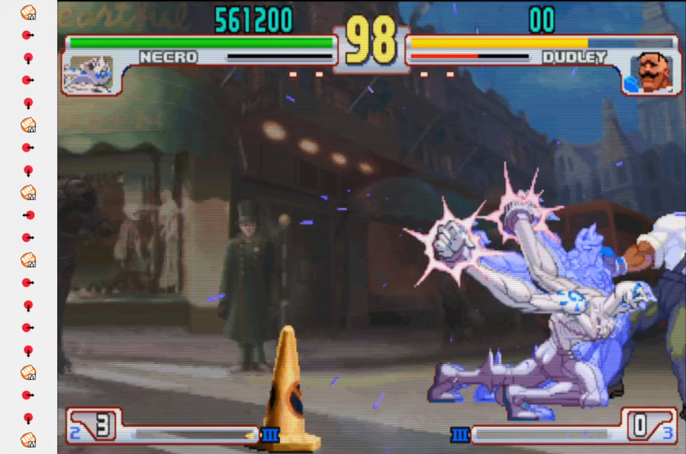

# input-log
A java input display for my fighting games experience.

## Installation
You will need Java 9+.

```
$ git clone https://github.com/youngkaneda/input-log
$ cd input-log
$ mvn clean package
$ java -jar target/input-log-1.0.jar
```

## How configure buttons.

For mapping the buttons, I was through some hardcoded ways, on ``config.properties`` in resources folder, just write the key name, and for wich button; each propertie key means the button sprite file name that I used.
```
...
up=VC_SPACE
lp=VC_KP_7
lk=VC_KP_4
...
```
*I used the JNativeHook variable names for the keyboard keys, it was more readalbe, and because use the exact code values could cause erros, since different OS's use different values for each key.*

Said that you can use your own sprites, add new buttons, remove buttons, map it in your own way, ``.properties``, ``.json`` ..., just fork and change.

## Screenshot


## Motivation
A lot of training modes hava input display, but they are built-in, and I wanted one for when I was playing online, see if I had missed some moves execution.

## Limitations
When you press and hold more than one button, the second is not considered a "press", and it spammed in the window like if you are typing it.

## TODO
1. Create an option for the user map they buttons, they coming from any input device, controllers, arcades, keyboard.
2. Refact the default button mapping.

## What I learned
Well I could refresh some past contents in my head, writing a event bus, listeners, and I had to implement by myself some option for the JFrame since I was using an undecorated one for design purposes. I wrote a drag listener to move the window through the screen, and implemented one bottom border resize listener, since the user dragged the window in the bottom border, the listener recognized and resized the window according the user drag, I had to use some high school vectorial math, so, was a good chance to remember.

---
Feel free to fork and contribute.
